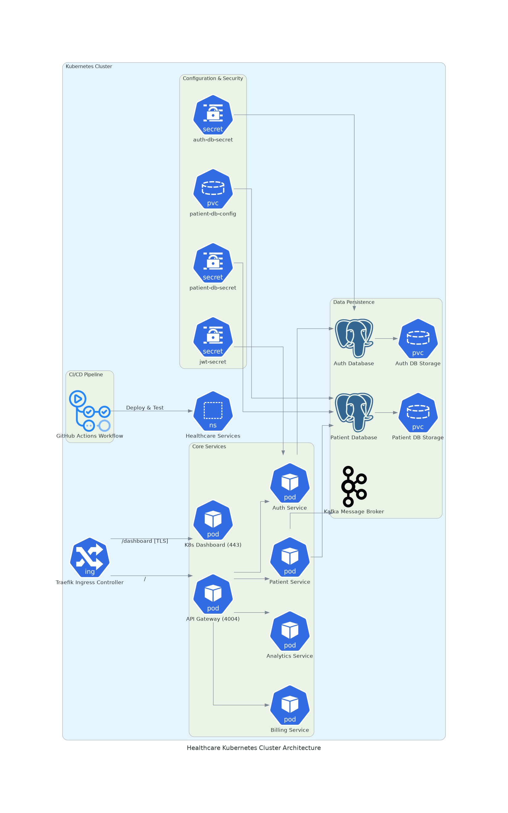

# 🏥 Patient Management System 2.0: Cloud-Native Evolution

[](https://github.com/Abdellahbounab/PatientManagementSystem/actions)
[](https://kubernetes.io)
[](https://www.docker.com)

**Now with Production-Grade Kubernetes Orchestration & CI/CD Automation!**

---

## 🚀 Key Enhancements (New!)
- **Kubernetes Cluster Deployment** with k3s
- **GitHub Actions CI/CD Pipeline** with automated testing
- **Kubernetes Dashboard** integration with RBAC
- **Infrastructure as Code** via comprehensive Makefile
- **Advanced Monitoring** of cluster resources
- **Production-Ready** service mesh architecture

---

## 🛠️ Tech Stack Supercharged
**Core Services**  
Spring Boot | gRPC | Kafka | PostgreSQL | Spring Security

**Cloud Native**  
Kubernetes (k3s) | Docker | GitHub Actions 

**Observability**  
Kubernetes Dashboard

---

## 🌐 System Architecture


---

## 🚦 Getting Started

### 📋 Prerequisites
- Docker 20.10+
- kubectl 1.28+
- k3d 5.6.0+

### 🛠️ Installation
```bash
# Clone repository
git clone git@github.com:Abdellahbounab/PatientManagementSystem.git
cd PatientManagementSystem

# Spin up cluster (Automatic in CI/CD)
make install && make build && make deploy

# Verify deployment
make status
```

### 🔍 Testing the System
```bash
# Run integration tests
make test

# Access services
API Gateway: http://localhost:4004
Dashboard: http://localhost:4004/dashboard
```

---

## 🔄 CI/CD Pipeline
**Automated Workflow Includes:**
1. Cluster provisioning with k3d
2. Docker image builds
3. Kubernetes deployment validation
4. Integration testing
5. Real-time status monitoring


---

## 📊 Monitoring & Operations
**Key Makefile Commands:**
```bash
make watch      # Real-time pod monitoring
make logs       # Aggregate service logs
make restart    # Zero-downtime deployments
make lint       # Validate Kubernetes manifests
```

---

## 🤝 Contribution Guidelines
1. Fork the repository
2. Create feature branch (`git checkout -b feature/amazing-feature`)
3. Commit changes (`git commit -m 'Add amazing feature'`)
4. Push to branch (`git push origin feature/amazing-feature`)
5. Open Pull Request

---